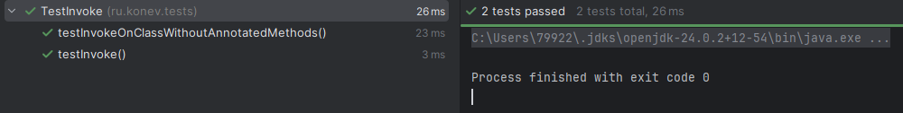
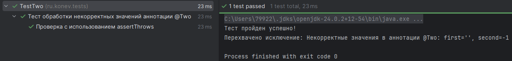

    <h1>Лабораторная работа №6</h1>
    <h2>Инструментирование кода</h2>
    <h2>Конев Михаил ПР-7</h2>
    <h3>Вариант 2</h3>

    <h2>Задание 1. Аннотации</h2>

    <h3>Задача 1 — @Invoke</h3>
    
<strong>Разработайте аннотацию @Invoke, со следующими характеристиками:</strong>

    <ul>
        <li>Целью может быть только МЕТОД </li>
        <li>Доступна во время выполнения программы</li>
        <li>Не имеет свойств</li>
        Создайте класс, содержащий несколько методов, и проаннотируйте хотя бы один из них 
аннотацией @Invoke. Реализуйте обработчик (через Reflection API), который находит методы, отмеченные 
аннотацией @Invoke, и вызывает их автоматически. 
    </ul>
    
<strong>Решение:</strong>

    

        Создана аннотация @Invoke с Target(ElementType.METHOD)
        и Retention(RetentionPolicy.RUNTIME).
        Реализован обработчик InvokeReflection, который через Reflection API
        находит методы, помеченные @Invoke, и автоматически вызывает их.
        Для приватных методов используется setAccessible(true).
    

    
<strong>Результат тестирования:</strong>

    
Задача 1.1: Аннотация @Invoke

    
В данном задании необходимо создать своего кота - ввести имя коту. Далее будет применена аннотация @Invoke для автоматического вызова метода meow().

    
Введите имя кота: Барсик

    
Барсик: мяу!

    <h3>Задача 2 — @Default</h3>
    
<strong>Разработайте аннотацию @Default, со следующими характеристиками:</strong>

    <ul>
        <li>Целью может быть ТИП или ПОЛЕ </li>
        <li>Доступна во время исполнения программы </li>
        <li>Имеет обязательное свойство value типа Class</li>
        Проаннотируйте какой-либо класс данной аннотацией, указав тип по умолчанию. 
        Напишите обработчик, который выводит имя указанного класса по умолчанию.
    </ul>
    
<strong>Решение:</strong>

    

        Разработана аннотация @Default(Class value).
        Обработчик DefaultReflection извлекает значение value
        и выводит имя класса по умолчанию.
        При отсутствии аннотации выбрасывается IllegalArgumentException.
    

    
<strong>Результат: Введите имя: Иван

Введите возраст (число): 20

Введите пароль (только буквы и пробелы): qwerty

Введите должность (только буквы и пробелы): Стажёр

</strong> Класс по умолчанию: Person

    <h3>Задача 3 — @ToString</h3>
    
<strong>Разработайте аннотацию @ToString, со следующими характеристиками:</strong>

    <ul>
        <li>Целью может быть ТИП или ПОЛЕ</li>
        <li>Доступна во время исполнения программы </li>
        <li>Имеет необязательное свойство valuec двумя вариантами значений: YES или NO</li>
        <li>Значение свойства по умолчанию: YES </li>
        Проаннотируйте класс аннотацией @ToString, а одно из полей – с @ToString(Mode.NO). 
Создайте метод, который формирует строковое представление объекта, учитывая только те поля, 
где @ToString имеет значение YES. 
    </ul>
    
<strong>Решение:Введите имя: Иван

Введите возраст (число): 20

Введите пароль (только буквы и пробелы): qwerty

Введите должность (только буквы и пробелы): Стажёр

</strong>

    

        Создан enum Mode { YES, NO }.
        Реализован метод формирования строки, который
        включает только поля с Mode.YES или без аннотации.
        Поля с Mode.NO исключаются из вывода.
    

    
<strong>Результат:</strong>

    
Person [ name = Иван age = 20 role = Стажёр ]

    <h3>Задача 4 — @Validate</h3>
    
<strong>Разработайте аннотацию @Validate, со следующими характеристиками:</strong>

    <ul>
        <li>Целью может быть ТИП или АННОТАЦИЯ</li>
        <li>Доступна во время исполнения программы</li>
        <li>Имеет обязательное свойство value, типа Class[] </li> 
    </ul>
    Проаннотируйте класс аннотацией @Validate, передав список типов для проверки. 
Реализуйте обработчик, который выводит, какие классы указаны в аннотации.
    
<strong>Решение: Введите название товара: Огурец

Введите цену товара (может быть дробным числом): 59.9

Введите количество товара (целое число): 3

String

Double

Integer
</strong>

    

        Аннотация хранит массив классов для проверки.
        Обработчик ValidateReflection выводит список указанных классов.
        При пустом массиве выбрасывается IllegalArgumentException.
    

    <h3>Задача 5 — @Two</h3>
    
<strong>Разработайте аннотацию @Two, со следующими характеристиками: </strong>

    <ul>
        <li>Целью может быть ТИП </li>
        <li>Доступна во время исполнения программы </li>
        <li>Имеет два обязательных свойства: first типа String и second типа int</li>
        Проаннотируйте какой-либо класс аннотацией @Two, передав строковое и числовое значения. 
Реализуйте обработчик, который считывает и выводит значения этих свойств. 
    </ul>
    
<strong>Решение:</strong>

    

        Аннотация применяется к классу.
        Обработчик через Reflection извлекает значения свойств
        и выводит их в консоль.
    

    
<strong>Результат:
    </strong> Барсик, 5 лет

    <h3>Задача 6 — @Cache</h3>
    
<strong>Разработайте аннотацию @Cache, со следующими характеристиками: </strong>

    <ul>
        <li>Целью может быть ТИП </li>
        <li>Доступна во время исполнения программы</li>
        <li>Имеет необязательное свойство value, типа String[] </li>
        <li>Значение свойства по умолчанию: пустой массив </li>
        Проаннотируйте класс аннотацией @Cache, указав несколько кешируемых областей. 
Создайте обработчик, который выводит список всех кешируемых областей или сообщение, что 
список пуст. 
    </ul>
    
<strong>Решение:</strong>

    

        Аннотация хранит список кешируемых областей.
        Обработчик выводит список областей либо сообщает,
        что кеширование не задано.
    

    
<strong>Результат:</strong> [Товар, Цены, Количество]

    <h2>Задание 2. Тестирование</h2>

    <h3>Тест @Invoke</h3>
    <h4>Создайте тест, используя фреймворк JUnit, который проверяет корректность вызова методов, 
отмеченных аннотацией @Invoke. </h4>
    <ul>
        <li>Использовать Reflection API для поиска методов с аннотацией.</li>
        <li>Убедиться, что метод действительно выполняется без исключений.</li>
        <li>Проверить, что возвращаемое значение или побочный эффект соответствует ожиданиям 
(например, устанавливает флаг или изменяет состояние объекта). </li>
        <li>Тест должен использовать аннотацию @BeforeEach для подготовки тестируемого 
экземпляра класса.</li>
    </ul>
    

        Тест подтверждает автоматический вызов метода
        без возникновения исключений.
    

  

    <h3>Тест @Two (некорректные значения)</h3>
    <h4>Разработайте тест, используя фреймворк JUnit, проверяющий корректность обработки 
аннотации @Two, если её свойства заданы некорректно. Например, строковое свойство first пустое 
(""), а числовое second отрицательное. </h4>
    <ul>
        <li>Создайте вспомогательный класс с аннотацией @Two(first = "", second = -1). </li>
        <li>В тесте реализуйте метод, который через Reflection считывает значения аннотации.</li>
        <li>Если одно из свойств нарушает ожидаемые условия (first – пустая строка, second < 0), то 
должен быть выброшен IllegalArgumentException. /li>
        <li>Используйте assertThrows() из JUnit для проверки выбрасываемого исключения. </li>
    </ul>
    

        При нарушении условий выбрасывается IllegalArgumentException.
        Тест успешно подтверждает корректную обработку ошибки.
    

            

  

